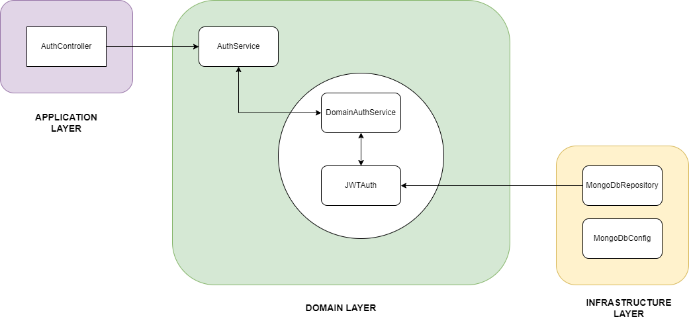

# Authentication
Registracija in prijava uporabnika v sistem. Ob registraciji se podajo podatki kot so ime, priimek, E-naslov, geslo,... Uporabnik se v sistem vpiše z e-mailom in geslom.
 
 
| Funkcionalne zahteve | Nefunkcionalne zahteve |
| :------------- | :------------- |
| Registracija uporabnika | Obvestilo o potrditvi registracije je poslan v manj kot 5 minutah |
| Vpis uporabnika | Prijava se izvede v manj kot 5 sekundah |
| Odjava uporabnika | Uporabnik je preusmerjen na prvotno stran |

 

