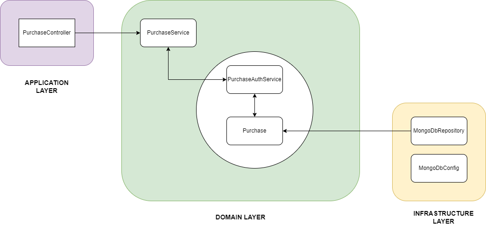

# Purchase
E-vinjeta je vezana na registrsko označbo vozila. Ob nakupu mora uporabnik navesti pravilno registrsko oznako in državo registracije vozila ter izbrati e-vinjeto za pravilen cestninski razred. Za pravilnost vnosa registrske oznake in izbiro cestninskega razreda je odgovorna stranka.
 
 
| Funkcionalne zahteve | Nefunkcionalne zahteve |
| :------------- | :------------- |
| Vnos registrske št vozila | Preverjanje veljavnosti registrske št |
| Izbira e-vinjete | Uporabnik lahko izbera med vrstami e-vinjet in cestninskimi razredi |
| Izvedba transakcije | Transakcija se izvede v manj kot 15 sekundah |

 

