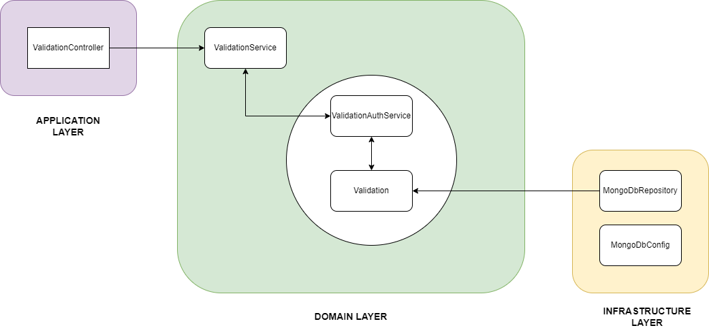

# Validation
Uporabnik lahko preveri veljavnost svojih vinjet s Pregledom veljavnosti e-vinjet, ki mu izpiše pregled datumov veljavnosti za vsako e-vinjeto. Uporabnik ima tudi možnost dodajanje obstoječih vinjet z vnosom registrske št in št e-vinjete.
 
 
| Funkcionalne zahteve | Nefunkcionalne zahteve |
| :------------- | :------------- |
| Pregled veljavnih e-vinjet | Uporabnik ima lahko več različnih e-vijet za različna vozila |
| Pregled podatkov o posamezni e-vinjeti | S klikom na e-vinjeto se odprejo podatki o e-vinjeti |
| Vnos obstoječe e-vinjete | Vnos se izvede v manj kot 15 sekundah |

 

